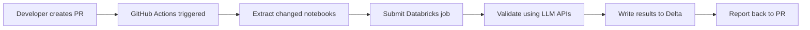

# Option 3: GitHub Actions CI/CD Integration

Deploy the Databricks Code Validator as a GitHub Actions workflow that validates notebooks on pull requests using Databricks APIs.

## Overview

This deployment option creates a **CI/CD pipeline** that automatically validates notebook changes in pull requests. This approach is ideal for:

- 🔍 **Automated PR validation** - Block PRs with code standard violations
- 🚫 **Pre-merge quality gates** - Prevent bad code from reaching main branch
- 📊 **Delta table integration** - Track validation trends over time
- 🔄 **Seamless developer workflow** - No manual validation steps required

## Architecture



## Prerequisites

✅ GitHub repository with Actions enabled
✅ Databricks workspace with API access
✅ Databricks repository sync configured (Repos)
✅ LLM provider credentials in Databricks Secrets
✅ Unity Catalog or Hive metastore access

## Step 1: Setup Databricks Repository

### 1.1 Clone Repository to Databricks

1. Navigate to **Workspace** → **Repos** in Databricks
2. Click **"Add Repo"**
3. Enter your repository URL: `https://github.com/your-org/your-repo`
4. Choose destination path: `/Workspace/Repos/your-org/your-repo`
5. Clone the repository

### 1.2 Configure LLM Provider Secrets

Create secrets for your LLM provider:

```bash
# Create secret scope
databricks secrets create-scope llm_credentials

# Add secrets (choose based on your LLM provider)
databricks secrets put-secret llm_credentials endpoint_url
databricks secrets put-secret llm_credentials api_key
```

**For different providers:**
- **Databricks**: `endpoint_url` = serving endpoint URL, `api_key` = PAT token
- **OpenAI**: `api_key` = OpenAI API key
- **Anthropic**: `api_key` = Anthropic API key

## Step 2: Configure GitHub Secrets

Add these secrets to your GitHub repository (**Settings** → **Secrets and variables** → **Actions**):

| Secret Name | Example Value | Description |
|-------------|---------------|-------------|
| `DATABRICKS_HOST` | `https://your-workspace.cloud.databricks.com` | Databricks workspace URL |
| `DATABRICKS_TOKEN` | `dapi-abc123...` | Databricks personal access token |
| `LLM_PROVIDER_TYPE` | `databricks` | LLM provider (databricks/openai/anthropic) |
| `LLM_ENDPOINT_URL` | `https://your-workspace.../serving-endpoints/...` | LLM endpoint URL |
| `LLM_MODEL_NAME` | `databricks-dbrx-instruct` | Model name to use |

### 2.1 Create Databricks PAT Token

1. Go to **Databricks Settings** → **Developer** → **Access Tokens**
2. Click **"Generate New Token"**
3. Set expiration and description
4. Copy the token value to `DATABRICKS_TOKEN` secret

## Step 3: Customize Validation Configuration

### 3.1 Update Repository Paths

Edit `.github/scripts/extract_changed_notebooks.py` to match your repository structure:

```python
def convert_to_workspace_path(file_path: str) -> str:
    """Convert repository file path to Databricks workspace path"""

    # Customize this mapping based on your repo structure
    if file_path.startswith('notebooks/'):
        # notebooks/analytics/sales.py -> /Workspace/Repos/org/repo/notebooks/analytics/sales
        workspace_path = f"/Workspace/Repos/{os.environ.get('GITHUB_REPOSITORY')}/{file_path}"
        # Remove file extension for workspace path
        if workspace_path.endswith('.py'):
            workspace_path = workspace_path[:-3]
        return workspace_path
    else:
        # Map other directories as needed
        return f"/Workspace/Repos/{os.environ.get('GITHUB_REPOSITORY')}/{file_path}"
```

### 3.2 Update Delta Table Configuration

Edit `.github/scripts/validate_via_databricks.py` to specify your Delta table:

```python
# Change this line to your desired table
table_name = "your_catalog.your_schema.ci_validation_results"
```

### 3.3 Customize Validation Rules

Modify `config/validation_rules.yaml` to match your organization's standards:

```yaml
global:
  enabled: true
  batch_size: 5
  max_retries: 2

# Add/modify validation rules as needed
code_quality:
  enabled: true
  rules:
    naming_conventions:
      enabled: true
      severity: "error"
    # ... other rules
```

## Step 4: Test the Workflow

### 4.1 Create Test PR

1. Create a new branch with notebook changes
2. Push the branch to GitHub
3. Create a pull request to main branch
4. The workflow should trigger automatically

### 4.2 Monitor Workflow Execution

1. Go to **Actions** tab in your GitHub repository
2. Click on the running workflow
3. Monitor the job progress and logs
4. Check for any errors in the validation steps

### 4.3 Verify Results

**Check GitHub PR:**
- ✅ Green check = All validations passed
- ❌ Red X = Validation failures found
- Click "Details" to see validation logs

**Check Delta Table:**
```sql
SELECT
    pr_number,
    pr_branch,
    notebook_path,
    rule_name,
    status,
    validation_timestamp
FROM your_catalog.your_schema.ci_validation_results
WHERE pr_number = 123  -- Your PR number
ORDER BY validation_timestamp DESC;
```

## Step 5: Production Configuration

### 5.1 Branch Protection Rules

Configure branch protection in GitHub (**Settings** → **Branches**):

1. Add rule for `main` branch
2. Enable **"Require status checks to pass before merging"**
3. Select **"Validate Notebooks on PR"** as required check
4. Enable **"Require branches to be up to date before merging"**

### 5.2 Workflow Optimization

For better performance, consider these optimizations:

**Parallel Validation:**
```yaml
# In .github/workflows/validate-notebooks.yml
strategy:
  matrix:
    chunk: [1, 2, 3, 4]  # Split notebooks into chunks
```

**Conditional Execution:**
```yaml
# Only run on specific file changes
on:
  pull_request:
    paths:
      - 'notebooks/**'
      - 'src/**/*.py'
      - 'config/validation_rules.yaml'
```

**Caching:**
```yaml
- name: Cache Python dependencies
  uses: actions/cache@v3
  with:
    path: ~/.cache/pip
    key: ${{ runner.os }}-pip-${{ hashFiles('requirements.txt') }}
```

### 5.3 Advanced Configuration

**Multiple Environments:**
```yaml
# Validate against different environments
strategy:
  matrix:
    environment: [dev, staging, prod]
    include:
      - environment: dev
        databricks_host: ${{ secrets.DATABRICKS_HOST_DEV }}
      - environment: prod
        databricks_host: ${{ secrets.DATABRICKS_HOST_PROD }}
```

**Custom Notification:**
```yaml
- name: Comment on PR
  if: failure()
  uses: actions/github-script@v6
  with:
    script: |
      github.rest.issues.createComment({
        issue_number: context.issue.number,
        owner: context.repo.owner,
        repo: context.repo.repo,
        body: '❌ Notebook validation failed. Please review the errors and fix before merging.'
      })
```

## Monitoring and Troubleshooting

### Dashboard Setup

Create a dashboard to monitor CI/CD validation trends:

```sql
-- Validation success rate by PR
SELECT
    pr_number,
    pr_branch,
    COUNT(*) as total_validations,
    SUM(CASE WHEN status = 'passed' THEN 1 ELSE 0 END) as passed_validations,
    ROUND(100.0 * SUM(CASE WHEN status = 'passed' THEN 1 ELSE 0 END) / COUNT(*), 2) as success_rate
FROM your_catalog.your_schema.ci_validation_results
WHERE validation_timestamp >= CURRENT_DATE() - INTERVAL 30 DAYS
GROUP BY pr_number, pr_branch
ORDER BY pr_number DESC;
```

### Common Issues

**1. GitHub Actions Authentication Failed**
```
❌ Error creating Databricks workspace client
```
**Solutions:**
- Verify `DATABRICKS_HOST` and `DATABRICKS_TOKEN` secrets
- Check token permissions and expiration
- Ensure workspace URL format is correct

**2. Notebook Path Not Found**
```
❌ Error validating /Workspace/Repos/org/repo/notebooks/analysis
```
**Solutions:**
- Verify repository is cloned to Databricks
- Check workspace path mapping in `extract_changed_notebooks.py`
- Ensure notebook exists in Databricks workspace

**3. LLM Provider Authentication Failed**
```
❌ LLM configuration error
```
**Solutions:**
- Verify Databricks secrets are configured correctly
- Check LLM endpoint URLs and model names
- Test LLM provider access from Databricks

**4. Delta Table Permission Denied**
```
❌ Error saving to Delta: Permission denied
```
**Solutions:**
- Verify Unity Catalog permissions
- Check table/catalog exists
- Ensure service principal has write access

### Log Analysis

**Successful Validation:**
```
🔍 Extracting changed notebooks from PR...
Found 3 notebook files
📝 Prepared 3 notebooks for validation
🚀 Submitted validation job: 12345
✅ Job completed: SUCCESS
📊 Validation Results: Passed: 15, Failed: 0
✅ All validations passed
```

**Failed Validation:**
```
❌ Job completed: FAILED
📊 Validation Results: Passed: 12, Failed: 3
❌ Validation failed - blocking PR
```

## Best Practices

### Security
- 🔐 **Use Databricks Secrets** for LLM credentials
- 🔒 **Rotate tokens regularly** (set expiration dates)
- 🛡️ **Limit token scope** to minimum required permissions

### Performance
- ⚡ **Optimize notebook selection** - only validate changed files
- 📦 **Batch similar notebooks** for efficiency
- 🔄 **Cache dependencies** to speed up workflows

### Reliability
- 🔄 **Configure retry logic** for transient failures
- 📧 **Set up proper notifications** for team awareness
- 📊 **Monitor validation trends** to catch systematic issues

### Developer Experience
- 📝 **Clear error messages** in PR comments
- 🚀 **Fast feedback loops** (< 5 minutes for typical PRs)
- 📚 **Documentation** for resolving common validation errors

## Scaling Considerations

### High-Volume Repositories

For repositories with many notebooks or frequent PRs:

1. **Implement smart diffing** - only validate modified notebook sections
2. **Use parallel job execution** - split validation across multiple Databricks jobs
3. **Implement validation caching** - cache results for unchanged notebooks
4. **Optimize LLM calls** - batch similar validations together

### Multi-Repository Setup

For organizations with multiple repositories:

1. **Centralized validation service** - shared Databricks workspace
2. **Standardized configuration** - common validation rules across repos
3. **Cross-repository reporting** - consolidated Delta table
4. **Template workflows** - reusable GitHub Actions

## Next Steps

1. **Test thoroughly** with various notebook types and changes
2. **Train your team** on interpreting validation results
3. **Iterate on rules** based on validation feedback
4. **Monitor and optimize** performance over time
5. **Consider extending** to other file types (SQL, R, etc.)

## Support

For issues with this deployment option:
1. Check GitHub Actions logs for detailed error messages
2. Verify Databricks job execution logs
3. Review the troubleshooting section above
4. Test individual components in isolation
5. Open an issue in the project repository